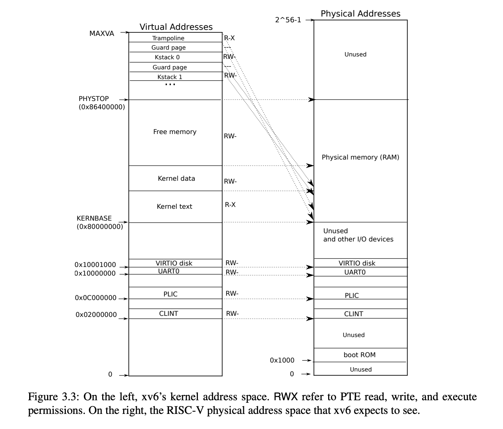

# xv6: Physical Memory Allocation and Comparisons With Linux

The code is in `kalloc.c`

The physical memory allocation in xv6 is very simple, it uses free list to manage physical memory. xv6 divides physical memory into pages with 4 KB for each page. 

Free list is the most simple data structures to alllocate memory. It is only a linked list to include all free pages. 

Let's look at the data structure of free list. `run` is a linked node containing one page, it links to next free page.  One important fact is that `run` does not consume extra memory, each `run` node data is directly put into the page assigned to it. 

As for kmem, it maintains a freelist and also a spinlock. A spinlock is required when accessing freelist because freelist is shared data. 

```C
struct run {
  struct run *next;
};

struct {
  struct spinlock lock;
  struct run *freelist;
} kmem;
```

Init kenerl physical mem when booting. `freerange` is to create a initial free list.  

```C

extern char end[]; // first address after kernel.
                   // defined by kernel.ld

void
kinit()
{
  initlock(&kmem.lock, "kmem");
  freerange(end, (void*)PHYSTOP);
}
```

The key of above code is to understand the `end`. Focus on  `KERNBASE` and `PHYSTOP` at the following. KERNBASE is a starting address to load kernel code, data. And after kernel data block, we can find a free memory block, which is managed by freelist here. And `end` is the first address after kenerl data block and also first address of free memory block, so the address of run node also is a page's starting address. 



And the interfaces to access kalloc is simple too. 

```C
void * kalloc(void); // allocate a page
void kfree(void *pa);// free a page
```

Let's look at kalloc. Getting the first node in freelist and then rturn it. 

```C
// Allocate one 4096-byte page of physical memory.
// Returns a pointer that the kernel can use.
// Returns 0 if the memory cannot be allocated.
void *
kalloc(void)
{
  struct run *r;

  acquire(&kmem.lock);
  r = kmem.freelist;
  if(r)
    kmem.freelist = r->next;
  release(&kmem.lock);

  if(r)
    memset((char*)r, 5, PGSIZE); // fill with junk
  return (void*)r;
}
```

pa is a starting address of a page, it should stays between end and PHYSTOP. And then pa is put into head of freelist.

```C
// Free the page of physical memory pointed at by v,
// which normally should have been returned by a
// call to kalloc().  (The exception is when
// initializing the allocator; see kinit above.)
void
kfree(void *pa)
{
  struct run *r;

  if(((uint64)pa % PGSIZE) != 0 || (char*)pa < end || (uint64)pa >= PHYSTOP)
    panic("kfree");

  // Fill with junk to catch dangling refs.
  memset(pa, 1, PGSIZE);

  r = (struct run*)pa;

  acquire(&kmem.lock);
  r->next = kmem.freelist;
  kmem.freelist = r;
  release(&kmem.lock);
}
```


