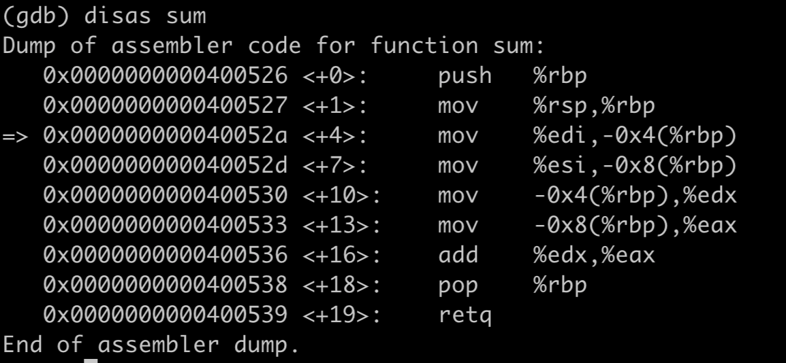

# Learn Assembly Code 
This lab is to learn assembly code on x86-64. 

```C
#include <stdio.h>
int sum (int a, int b) {
    return a + b;
}
int main() {
    int c = sum(10, 20);
    printf("%d\n", c);
 
    return 0;
}
```

Compile the code `gcc sum.c`

Click `gdb a.out` to enter into gdb. 

Use `disas sum` to disassemble the binary code of sum function.  




Right now, I will explain the assembly code line by line. 

%rbp is a base pointer register used to preserve current subprogram call address. 

`push %rbp` is to preserve current subprogram call address. 

%rsp is a stack pointer register pointing to 

`mov %rsp, %rbp` is to load sum entry   address into %rbp 

%rbp can be used to access the parameters of subprogram. As the stack grows down, so -0x4(%rbp) is to access first parameter of the subprogram. 

`mov %edi, -0x4(%rbp)`,  deliver 10 to a, where -0x4(%rbp) is address of a in stack. 

`mov %esi, -0x8(%rbp)`, deliver 20 to b, where -0x8(%rbp) is address of b in stack. 

`mov -0x4(%rbp), %edx`, load a to %edx

`mov -0x8(%rbp), %eax`, load b to %eax

`add %edx, %eax`, return a + b

`pop %rbp`, restore parent subprogram entry address. 

### Summary 

    1. %rbp serves current subprogram entry address. 
    2. Local variable address can be obtained from %rbp
    3. Before calling a subprogram, we need to preserve current program's %rbp in order to restore later. 


