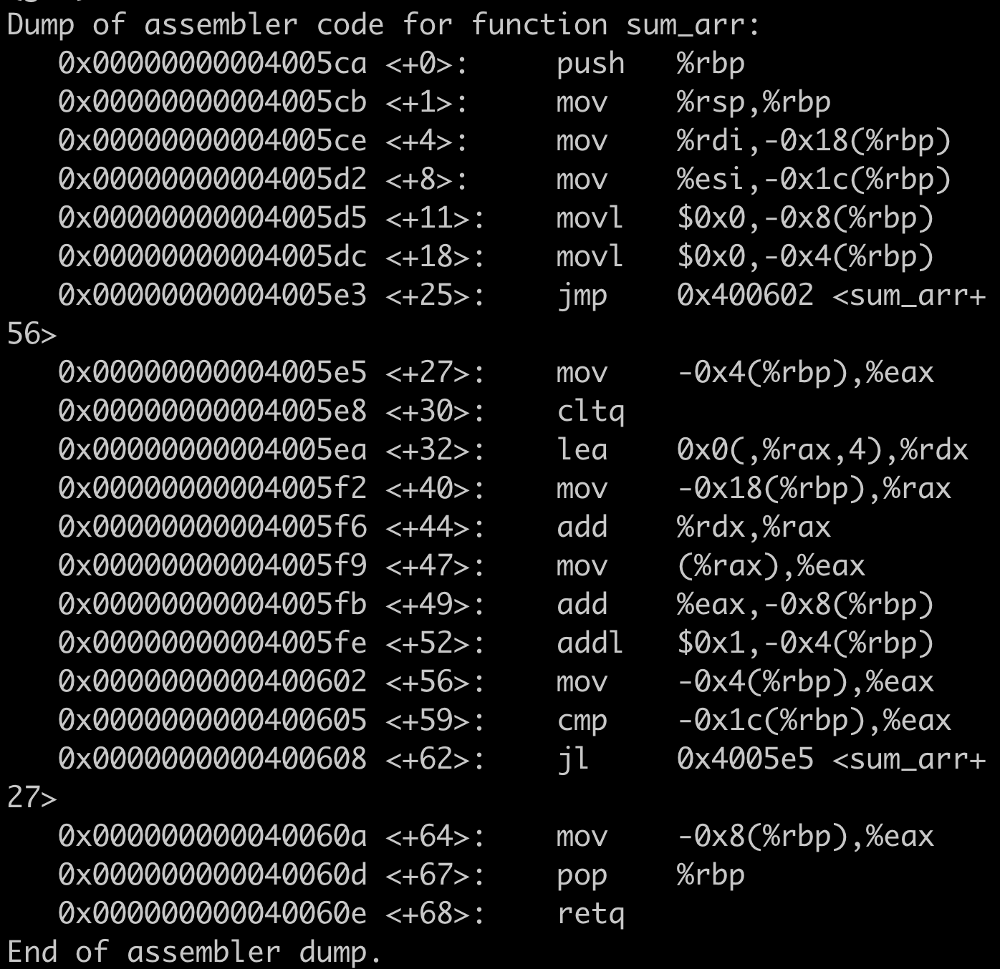

# Learn Assembly Code 
This lab is to learn assembly code on x86-64. 

## Understand Register Conventional Use 


## Start From a Simple Code

```C
#include <stdio.h>
int sum (int a, int b) {
    return a + b;
}

int cmp(int a, int b) {
    if (a > b) {
        return 1;
    }else {
        return 0; 
    }
}
int sum_arr(int* arr, int n ) {
    int s = 0;
    for(int i = 0; i < n; i++) {
        s += arr[i];
    }
    return s;
}
int main() {
    int c = sum(10, 20);
    printf("%d\n", c);
 
    int cmpvalue = cmp(11, 100);

    printf("%d\n", cmpvalue);

    int arr[] = {1,2,3,4,5};

    int s = sum_arr(arr, 5);
    printf("sum value is %d\n", s);
    return 0;
}
```

## sum assemble code 

Compile the code `gcc sum.c`

Click `gdb a.out` to enter into gdb. 

Use `disas sum` to disassemble the binary code of sum function.  


Right now, I will explain the assembly code line by line. 

%rbp is a base pointer register used to preserve current subprogram call address. 

`push %rbp` is to preserve current subprogram call address. 

%rsp is a stack pointer register pointing to 

`mov %rsp, %rbp` is to load sum entry   address into %rbp 

%rbp can be used to access the parameters of subprogram. As the stack grows down, so -0x4(%rbp) is to access first parameter of the subprogram. 

`mov %edi, -0x4(%rbp)`,  deliver 10 to a, where -0x4(%rbp) is address of a in stack. 

`mov %esi, -0x8(%rbp)`, deliver 20 to b, where -0x8(%rbp) is address of b in stack. 

`mov -0x4(%rbp), %edx`, load a to %edx

`mov -0x8(%rbp), %eax`, load b to %eax

`add %edx, %eax`, return a + b

`pop %rbp`, restore parent subprogram entry address. 

### Summary 
    1. %rbp serves current subprogram entry address. 
    2. Local variable address can be obtained from %rbp
    3. Before calling a subprogram, we need to preserve current program's %rbp in order to restore later. 


## cmp assemble code 


Let's start directly from `cmp` instruction 

`cmp -0x8(%rbp),%eax`, comapre b with a , where a is in %eax, and b is in -0x8(%rbp) 

`jle 0x4005c3 <cmp+25>`, jump to instruction 0x4005c3 if b is less than or equal to  a 


## sum_arr assemble code 




`mov  %rdi,-0x18(%rbp)`, the first arugment arr

`mov  %esi,-0x1c(%rbp)` , the second argument n 

`movl   $0x0,-0x8(%rbp)`, int s = 0 

`movl   $0x0,-0x4(%rbp)`, int  i = 0

`jmp    0x400602 <sum_arr+56>`, start to execute loop code 

`<+56>:	mov  -0x4(%rbp),%eax`, move i to %eax 

`cmp    -0x1c(%rbp),%eax`, compare n with i 

`<+62>:	jl     0x4005e5 <sum_arr+27>`, jump to 0x4005e5 if i < n 

`<+32>:	lea    0x0(,%rax,4),%rdx`, compute the address offset based on i 

`add    %rdx,%rax`, compute address of arr[i]

` <+47>: mov    (%rax),%eax` store arr[i] into %eax 

`<+49>:	add    %eax,-0x8(%rbp)`, s += arr[i]

### summary 
    1. Loop can still be implemented by cmp instruction 
    2. lea can be used to compute address offset 

Reference 

[Guide to x86-64](https://web.stanford.edu/class/cs107/guide/x86-64.html)