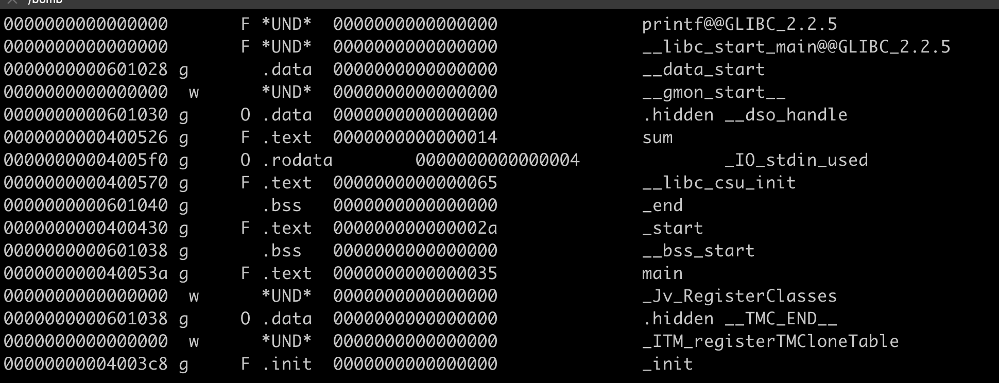
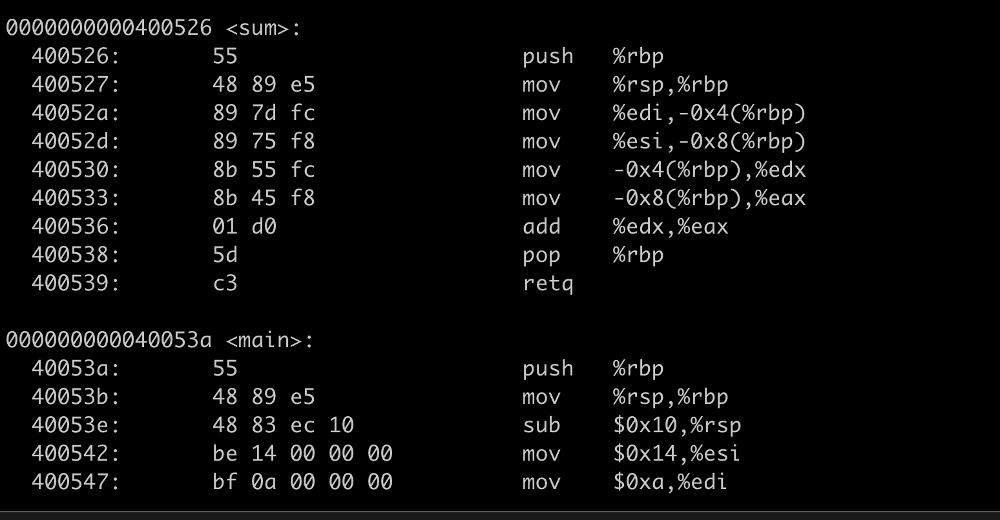

# Learn Objdump 

Objdump is a unix tool to diassemble binary code. 

```C
#include <stdio.h>
int sum (int a, int b) {
    return a + b;
}
int main() {
    int c = sum(10, 20);
    printf("%d\n", c);
 
    return 0;
}
```

Use `gcc sum.c ` to compile the code 

Use `objdump -t a.out` to print symbol table.



The above is part of symbol table. The last column is symbol name, we can find `main and sum` there. 

The symbol table contains all function calls and global variables used by the program, so we may get some information about the program from symbol table. 

Use `objdump -d a.out` to disassemble code 



From the above picture, we can get to know what occurs inner a function like `sum and main` using `objdump -d`

### Reference 

[What does each column of objdump's Symbol table mean?](https://stackoverflow.com/questions/6666805/what-does-each-column-of-objdumps-symbol-table-mean)


[CSAPP bomb lab wirte up](http://csapp.cs.cmu.edu/3e/bomblab.pdf)
