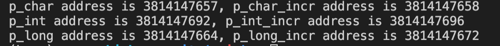
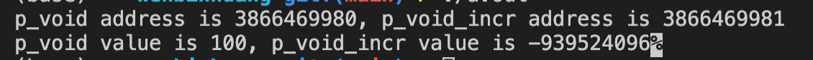

# C Language: Understanding Pointer Arithmetic Operation

Arithmetic operations in C is tricky and can cause many bugs if we don't understand the principles of arithmetic operations on pointer. 

The following code shows how pointer address is modified after arithmetic operations applys on different types of pointer.

```C
#include<stdio.h>
int main()
{
    char arr_char[3] = {'a', 'b', 'c'};
    int arr_int[3] = {100, 200,300};
    long arr_long[3] = {1000, 2000, 3000};

    char* p_char = arr_char;
    char* p_char_incr = p_char + 1;
    printf("p_char address is %u, p_char_incr address is %u \n", p_char, p_char_incr);

    int* p_int = arr_int;
    int* p_int_incr = p_int + 1;
    printf("p_int address is %u, p_int_incr address is %u \n", p_int, p_int_incr);

    long* p_long = arr_long;
    long* p_long_incr = p_long + 1;
    printf("p_long address is %u, p_long_incr address is %u \n", p_long, p_long_incr);

    return 0;
}
```

The output of above code 



From the above output, we know that `given arithmetic operation on different type pointers, we have different address offset`. 

1. For the char pointer, when we increment pointer by 1, the address is increased by `1`. 
2. For the int pointer, when we increment pointer by 1, the address is increased by `4`. 
3. For the long pointer, when we increment pointer by 1, the address is increased by `8`.

So we get to know a important rule: `when we increment pointer by 1, the address is increased by sizeof(type of pointer)`.

## Arithmetic operations on void pointer. 

`The arithmetic operation is not allowed on void pointer in standard C`, because the arithmetic operations depends on the type of pointer and we have no knowledge about the type of void pointer. 

However, in GNU C, the addition and substraction operations are supported on void pointer because the compiler assumes the size of void pointer is 1. 

The following code is the experiment of the addition operation on void pointer. 

```
#include<stdio.h>
int main()
{
    int arr_int[3] = {100, 200,300};
    
    void* p_void = (void* ) arr_int;

    void* p_void_incr = p_void + 1;

    printf("p_void address is %u, p_void_incr address is %u\n", p_void, p_void_incr);

    printf("p_void value is %d, p_void_incr value is %d", *(int*)p_void, *(int*)p_void_incr);
    return 0;
}
```

The output of above code in GNU C.



From the output, we know two things

1. When void pointer is increased by 1, the address is increased by 1, so the compiter assumes the size of void pointer is 1.
2. The value of `p_void_incr` is abnormal. 

So, `We should never use arithmetic operations on void pointer`, because it is tricky to assume the size void pointer is 1 and also arithmetic operations on void pointer are not supported in standard C. 


