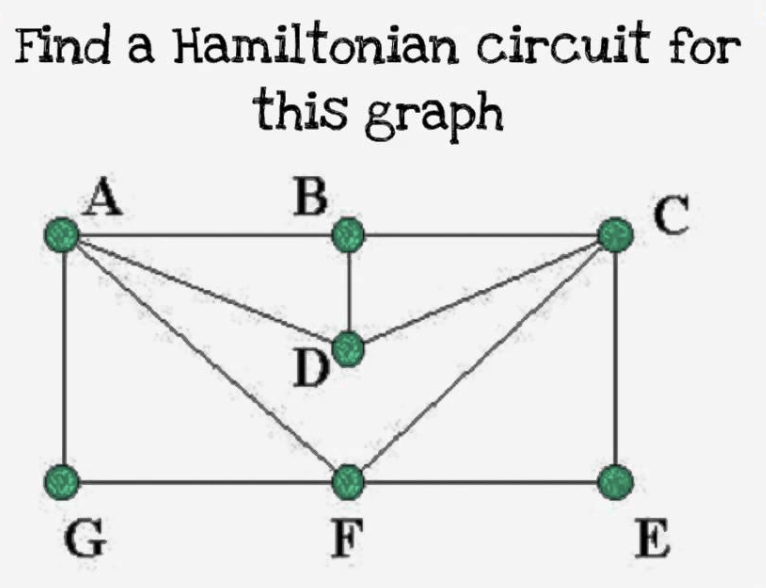

# 对NP定义的理解

我觉得NP的定义符合人类解决问题的直觉和技巧。 

比如 汉密顿回路问题, 我们希望在如下图中 是否能找到找到一个回路，从A点出发，遍历图中每个点，最后回到A点。 



解决这个问题有两种方式。

第一种方式是用计算机思维： 我们用穷举法， 穷举每一个可能的回路。 但是这种解法比较笨，得一个一个试。

第二种方式更符合我们的直觉和解决方法， 我们不穷举， 我们只要猜到一个汉密顿回路， 运气好的话，我们很快就可以猜到。对于如上的图， 我猜一个解是 A->D->B->C->E->F->G->A。 当然， 我们还得验证解。 这一步骤可以交给计算机去做， 如果计算机能够在多项式时间复杂度内验证这个解， 那么这个问题就是NP的。 对于上述的一个解，我们可以很快的构建一个算法验证。 

算法如下, 下面的算法时间复杂度为 O(n),所以 汉密尔顿回路是一个NP问题

```
Given inuput G<V, E> and a sequence v0, v1, ... vn-1, v0

Check the number of unique vetex in the sequence equaling to |V|  

for vi in v0, v1... vn-1 :
    let vi+1 be the next adjacent vetex of vi 
    if vi = vn-1:
        let vi+1 be v0

    if edge <vi, vi+1> not in E:
        return false 

return true
```

