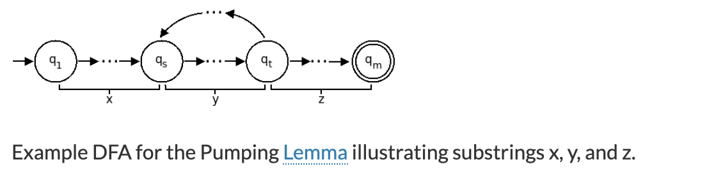

# Pumping Lemma, One of My Favorite Proof Skills

Pumping lemma is used to prove if a language is regular or context free. 

Here I will talk about pumping lemma used to prove a language is not regular. 

A regular language is equivalent to DFA. And pumping lemma uses an important and special property of DFA, that is if a langauge is infinite, the language must contain a repeated section. It can be illustrated by below picture. The repeated section is starting from qs to qt. 

So we define p as a pumping length where contains a repeated section. 

Based on above picture, a string in language A with at least length p  can be divided into three parts s = xyz, it satisfies three conditions

1. |y| >= 1 , because the repeated section must contain at least one symbol. 
2. |xy| <= p,  becuase the length of s is at least p, and repeated section stays within length p (according to pumping length definition ). 
3. For each i >=0, xy^iz is a string of A. 

Below is a language A, I will use pumping lemma to prove it is not regular. 

> A = {a^nb^n| n >=0} 

Assume A is regular, let s = xyz = ${a^pb^p}$.

According to pumping lemma, |xy| <= p, so y is in first p symbols, let y = $a^n$, where n >= 1, so we get s= xyz = ${a^{(p-n)}a^nb^p}$ .

So $xy^0z$ = ${a^{(p-n)}b^p}$ $\in$ A contracting ${a^{(p-n)}b^p}$ is not a palindrome.  

