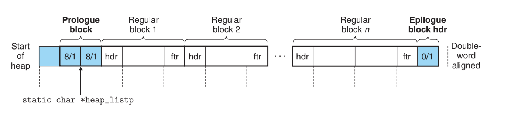
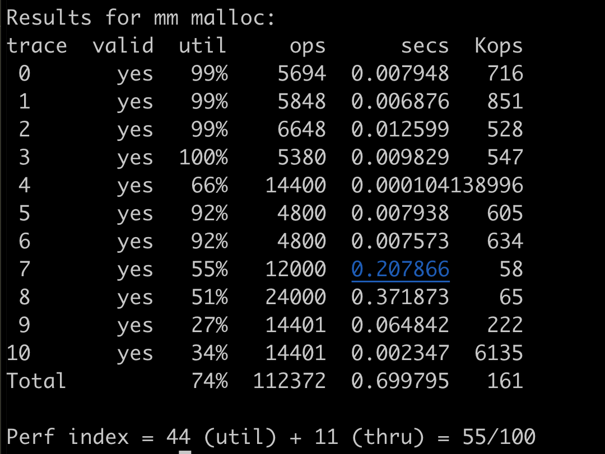
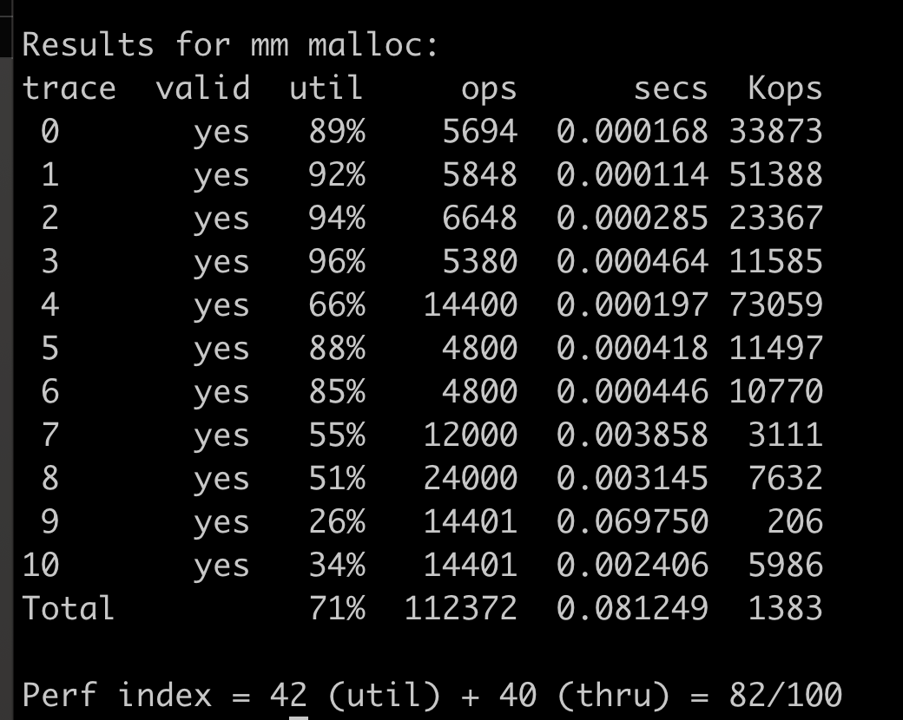

# CSAPP: Malloc Lab Summary 

## Prerequisites

In this lab, the most painful part is to code on pointers, especially void pointers. So it is very important to dive into pointers in C.

1. [Dive Into C Language Void Pointer](c_language_void_pointer.md)
2. [Understanding pointer arithmetic operations](c_understanding_pointer_arithmetic.md)

## Implicit Free List Implementation 

When implementing  implicit free list, it is very important to totally understand the memory format of implicit free list . 

Prologue block and epilogue block are a tricky part that eliminates edging conditions of coalescing. And epilogue block also used for detecting the end of implicit free list. 

### Output 

The score is pretty low, so we need to optimize the implementation. 

The major disavantages of implicit free list is that the malloc takes O(n) time complexity, not that efficient. 

## Explicit Free List 

[Explicit Free List Impelemntation](data-structure/data-structure-explicit-free-list.md)

The explicit free list maintains a doubly linked list for all free blocks, so when memory is nearly full, the performance of finding fit  block operation is improved.

### The Score 

Compared with implicit free list score, the throughput score improves from 11 to 82, which means explicit free list is better than implicit free list in finding a fit block. 

