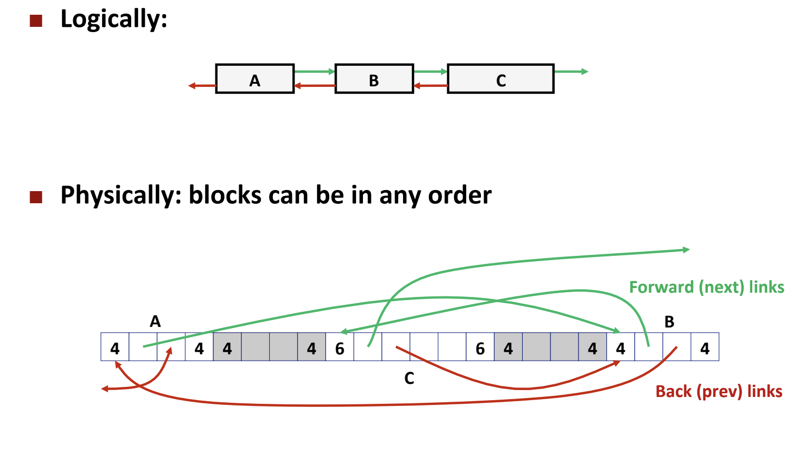
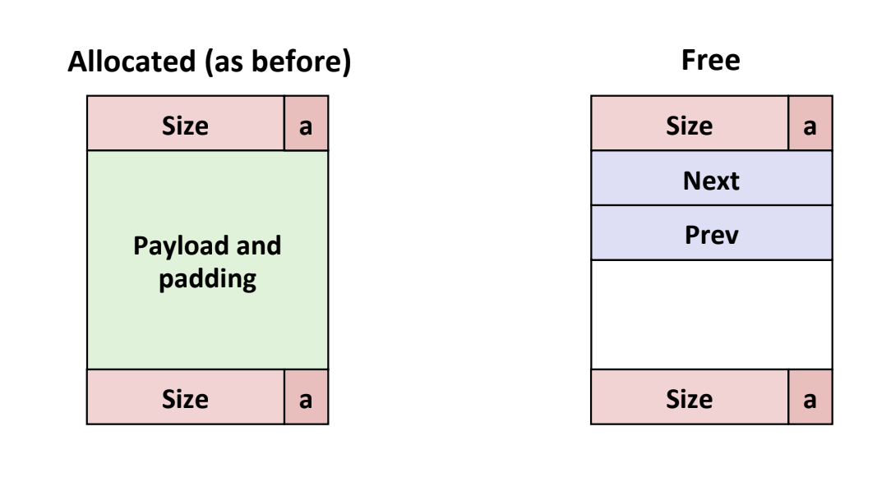

# Data Structure: Explicit Free List

Explicit free list is used in resource management, especially in memory and file system management. Compared with implicit free list, it only maintains a doubly linked list of free blocks. 

## Block Structure 

In each free block, we need to maintain prev and next pointer to form a doubly linked list. And we also need header and footer for coalescing. 

## Functions 

### Find a fit free block
1. we also need to maintain a dummpy root of explicit free list. We can reserve two words of heap for the root. 
2. Define a macro of GET_NEXT, GET_PREV, PUT_NEXT and PUT_FREE. 

### Allocate a block 
1. Find a fit block 
2. If not fit block found, extend heap 
3. Split the block 

### Split the block 

1. Set header, footer
2. Insert into the free list.
3. Disconnect a free block from list. 

### Coalescing 
1. When there are prev or next free blocks, disconnect from explicit free list 
2. Insert coalesced block into explicit free list. 

