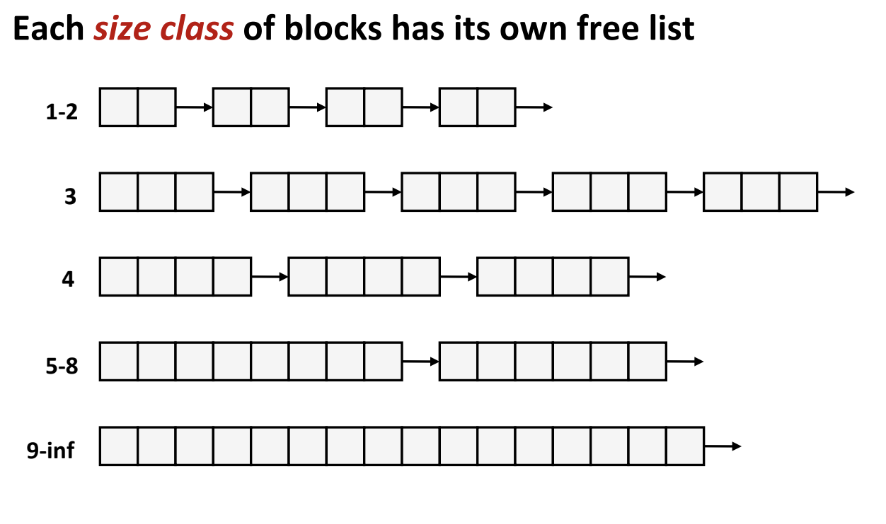

# Data Strucuture: Segregated List 

## Allocator Data Strucuture Evolution
Segregated List evolves from Implicit and Explicit Free List. So beofre diving into  Segregated List, it is necessary to understand these two. 

[Implicit Free List](../implicit_free_list.md)

[Explicit Free List](./data-structure-explicit-free-list.md)

The evolution direction is to optimize the time to find a fit block when allocating. 

Implicit Free List always takes O(n) of finding a fit block. 

Explicit Free List takes O(n) of finding a fit block in worse case, but when memory is close to full , it greatly improves searching time. 

The optimized direction of segregated list is using multiple free lists based on data size. 

## Key Idea: maintaining many free lists based on data size 

So compared with explicit free list, it can further reduce searching time based on data size. 

## Implementation Details 

### How Many Classes to Determine 

||data size(words)|
|---|---|
|class 0|1-2|
|class 1|3-4|
|class 2|5-8|
|class 3|9-16|
|class k|2^k + 1, 2^(k + 1)|

In the implementation, I determine to use 12 class. 

### Class root representation 

1. Reserve 2 words for each class root. 

2. Getting class root based on words size. 

### Finding a fit block 

1. Getting class number(denoted as class_no) based on size
2. Start from class_no, try to find free block, if no free block found in class_no, try to find in a bigger class_no.
3. If no free block in all free lists, extend the heap. 

### Allocation 
1. Finding a fit block
2. Placing the splitted free part into the correct class

### Free 
1. Insert the free block into corresponding free list

## Advantages 
1. Approximates best bit to reduce fragmentation.
