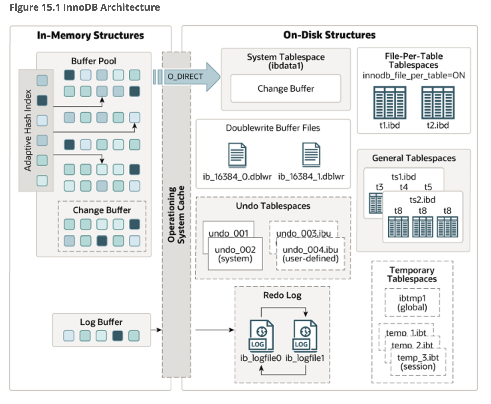

# Innodb Data Structure

Mysql Innodb storage engine is a very famous storage engine. Let's dive into the data structure in Innodb to understand how those data strucuture support the complex transaction. 

The memory data structure in Innodb served the purpose of reducing I/O access. 

Let's talk about buffer pool firstly. Buffer pool plays a key role for caching physical pages. The goal of buffer pool is keep frequently used page in cache, which is reduce number of I/O to improve performance. 

The data structure of buffer pool is a linked list for simplicity.  The most frequent block will be kept in the linked list head, while the least frequent block is kept in the linked list tail. 

Log buffer is nothing more than a piece of memory assigned for storing redo logs. This is also for performance consideration. The basic optimization idea is that we can fluch redo logs into disk in batch to reduce I/O. 

Change buffer is used to avoid the secondary index to access random I/O. So when there is a change of secondary index, it is not updated to disk directly, but cache in change buffer, and will be updated when the page is fetched. 

The tablespace is a abstraction data structure to partition the disk. In previous database, there is only one shared tablespace, but in mysql 8.0, it supports tablespace each table. Here I am to focus on undo tablespace, redo tablespace and also double write buffer. 

Undo tablespace is a storage layer for undo log. And usually undo log is also controlled by MVCC to enable consistent read without any lock. 

Redo tablespace is a storage layer for redo log, nothing more than the data on disk. 

Double write buffer is a very interesting on-disk data structure. This buffer is served for atomicity of buffer pool block flushing back to disk. When the buffer pool flushes blcok back to disk, the operation is not atomic, so when the machine crashes or power shuts down, the page may be written partially, and we are not able to know it is written partially. So double write buffer is introduced to fix this issue. The double write buffer introduces a small overhead on I/O operations, but as the I/O is operated sequentially , so the overhead is still acceptable. 

# Reference 

[Mysql 8.0 Manual](https://dev.mysql.com/doc/refman/8.0/en/)