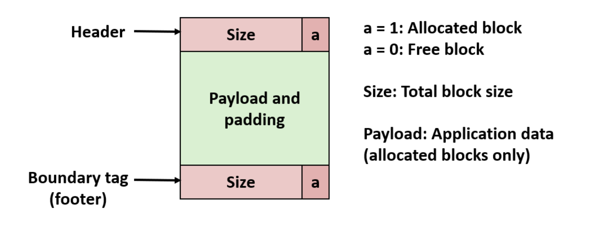

# Data Structure: Implicit Free List 

Implicit free list is a data structure used to manage allocated and free resources. One of its scenarios is typicallyused to manage memory allocation in heap. 

The idea of implicit free list comes from double linked list. The basic idea is simple, it uses block length to link previous and next block.  

So the basic unit for implicit free list to manage is block. And we need to know the length of a block and also a flag to detect if a blocked is free. 

And the operations supported by implicit free list should be:

1. Find a free available block 
2. Splitting a free block (for allocation)
3. Free a allocated block 
4. Coalecing free blocks ( used when free a block).

Advantage: Implementation is simple

Disavantage: Allocation performance is worse, allocating a block takes O(n)
