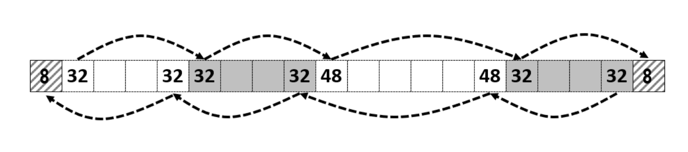
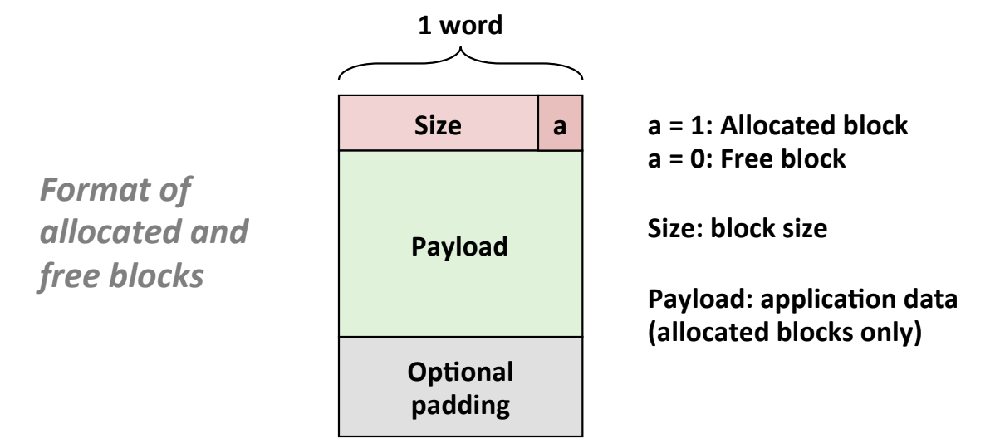

Implicit free list is a data structure used to manage allocated and free resources. One of its scenarios is typically that it can be used to manage memory allocation in heap. 

Implicit is a logical extension of linked list. The basic idea is simpe, it uses length to link all blocks.  

So the basic unit for implicit free list to manage is block. And we need to know the length of a block and also a flag to detect if a blocked is free. 

And the operations supported by implicit free list should be:

1. Find a free block 
2. Splitting a free block (for allocation)
3. Free a allocated block 
4. Coalecing free blocks ( used when free a block).
