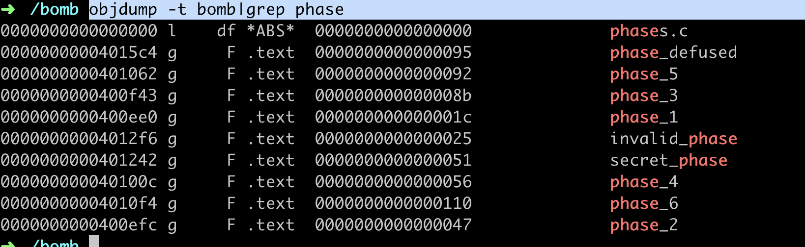

# CSAPP Bomb Lab 

As we don't have bomb source code, so we need to use tools like `gdb, coredump` to understand what happens inner bomb. 

Use `objdump -t bomb|grep phase` to get to know bomb function calls 

Use `objdump -d bomb` to get to know bomb assemble code. 

todo learning more assemble codes

