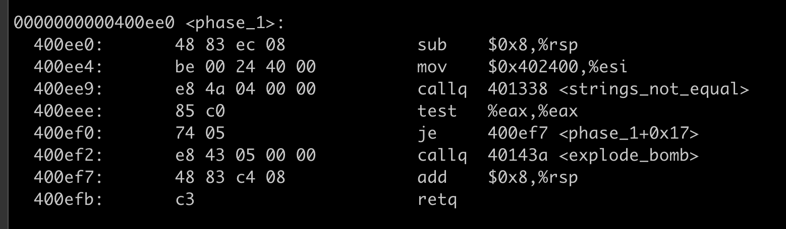
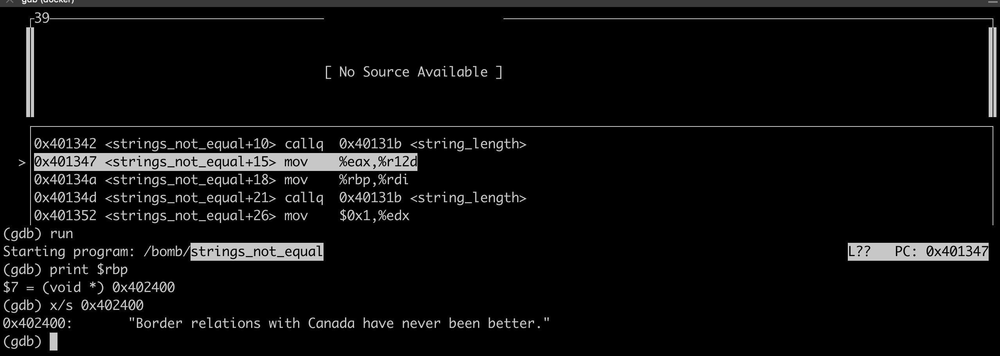
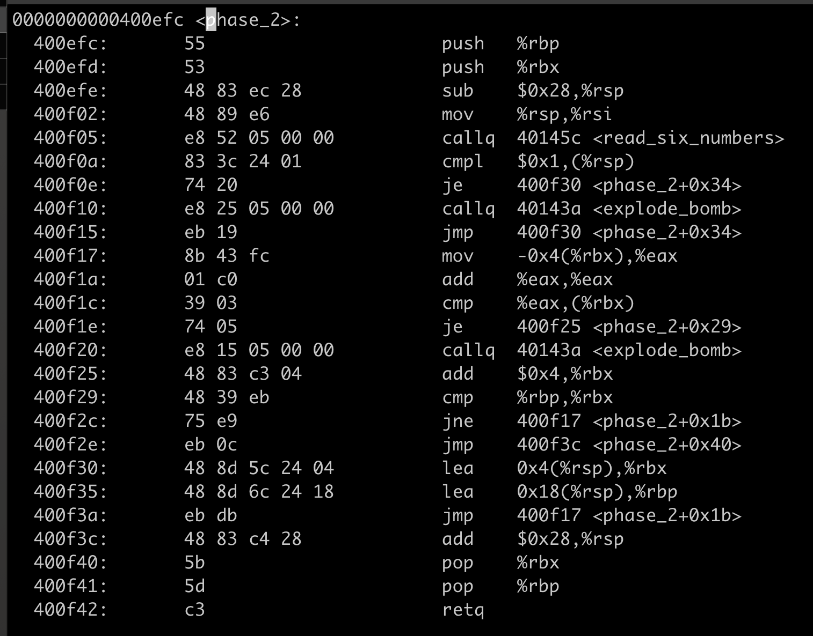
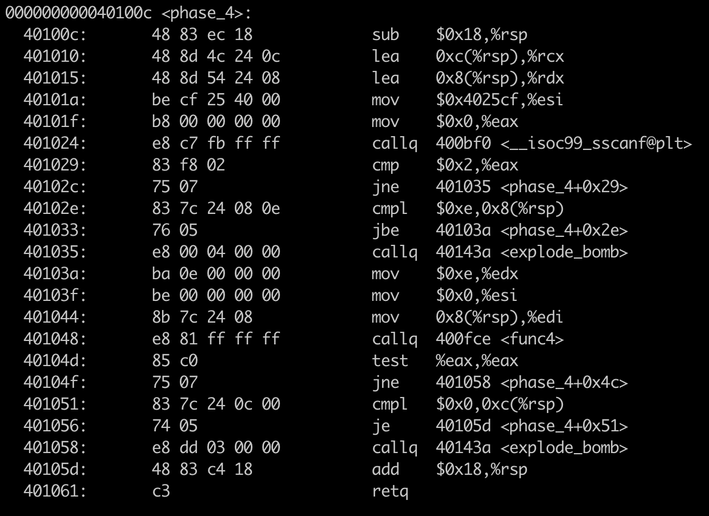
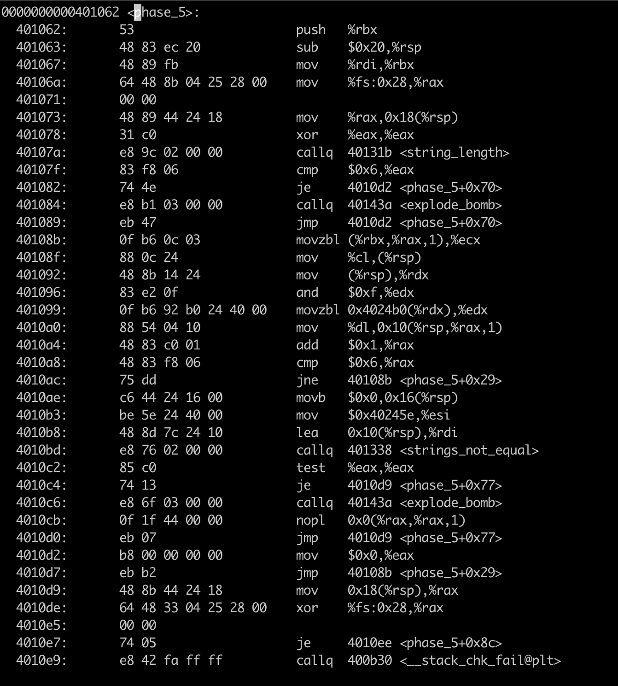
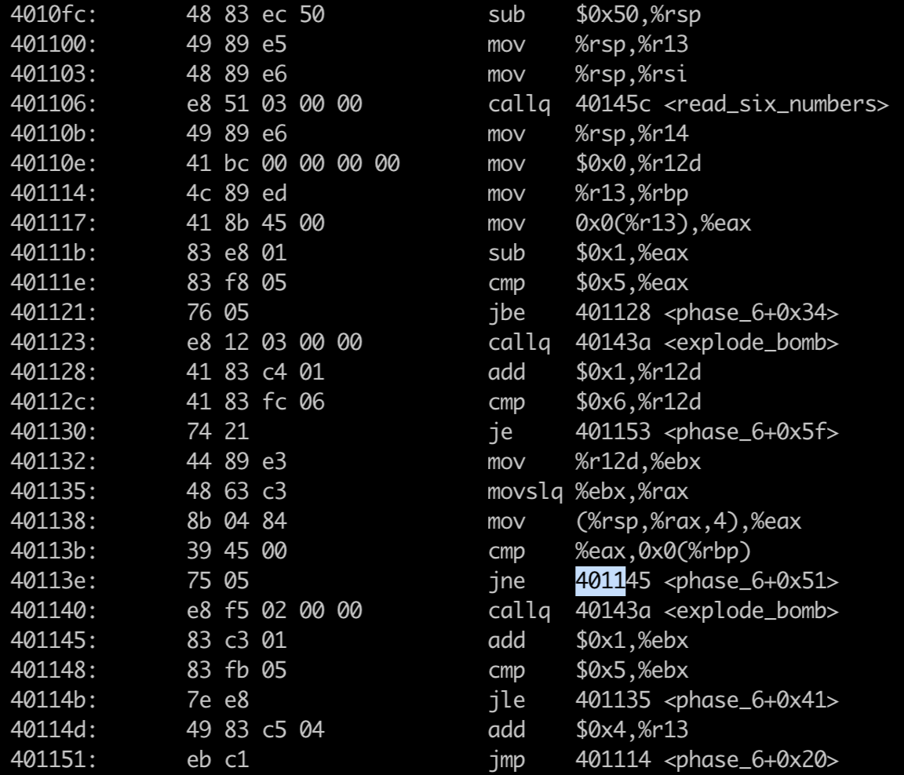
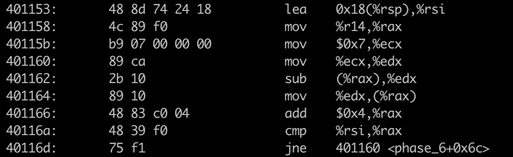
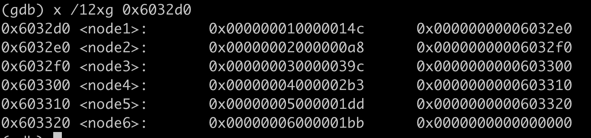

# CSAPP Bomb Lab 


## Phase 1
As we don't have bomb source code, so we need to use tools like `gdb, coredump` to understand what happens inner bomb. 

Use `objdump -t bomb|grep phase` to get to know bomb function calls 


Use `objdump -d bomb` to get to know bomb assemble code. 



The above code compare if two strings equal. The first string is the input string, and from `mov $0x402400, %esi`, we can know that the second string is stored in mem location `0x402400`

So we can use `gdb` to run the program to check what is stored in `0x402400`.

`break pahse_1` to set the break point.

`nexti` or `stepi` to execute next instruction 

`x/s 0x402400` to examine the string in this memory 

And the string is `Border relations with Canada have never been better.`




## Phase 2



From the above assemble code, I found there is a function `read_six_number`, so I infered that read_six_number is to scanf number from input, so we should input six number. 

Use `gdb` to follow the instruction to get to know what causes bomb.  And also use `x/w $rbx` or `p $eax` to examine value in register. 

And I found that the following code matters

```
400f17:       8b 43 fc                mov    -0x4(%rbx),%eax
400f1a:       01 c0                   add    %eax,%eax
400f1c:       39 03                   cmp    %eax,(%rbx)
400f1e:       74 05                   je     400f25 <phase_2+0x29>
400f20:       e8 15 05 00 00          callq  40143a <explode_bomb>
```


`-0x4(%rbx)` is current number, while (%rbx) is the next number, the bomb not occurs only when 2 * current number equals to next number 

so we can get the string `1 2 4 8 16 32`

## Phase3


Use `gdb` to execute the code line by line.

The key code is as following 

```
400f60:       83 f8 01                cmp    $0x1,%eax
400f63:       7f 05                   jg     400f6a <phase_3+0x27>
```

The above code keeps going when %eax is bigger than 1, otherwise bomb.

```
  400fb9:       b8 37 01 00 00          mov    $0x137,%eax
  400fbe:       3b 44 24 0c             cmp    0xc(%rsp),%eax
  400fc2:       74 05                   je     400fc9 <phase_3+0x86>
```

The above code return only when  0xc(%rsp) equals to 0x137

So the answer is `2 707`

## Phase 4



Use `w/s 0x4025cf` to print the string, we found that the no. input parameters is 2. 

From `  40104d:   85 c0    test   %eax,%eax`, we know that the func4 return value has to be 0

```
401051:       83 7c 24 0c 00          cmpl   $0x0,0xc(%rsp)
401056:       74 05                   je     40105d <phase_4+0x51>
```

From the above code, we know that the second parameters has to be `0`

So the key is to dive into `func4`


The input parameters are 

```
  40103a:       ba 0e 00 00 00          mov    $0xe,%edx
  40103f:       be 00 00 00 00          mov    $0x0,%esi
  401044:       8b 7c 24 08             mov    0x8(%rsp),%edi
```
so edx = 14, esi = 0, edi = first parameter of input 

Let's reverse the code of func4 using C. 

```C
int func4(int edi, int esi, int edx) {
    int ecx = (edx - esi) >> 31;
    int eax = (ecx + (edx - esi)) >> 1;
    ecx = eax + esi;

    if(ecx <= edi ) {
        if (ecx >= edi) {
            return 0;
        }
        eax =  func4(edi, ecx + 1, edx);

        return 2 * eax + 1;
    }else {
        //ecx > edi
        edx = ecx - 1; 
        eax = func4(edi, esi, edx);

        return 2 * eax; 
    }

}
```

Let's write program to check where func4 returning 0

```C
int main(void){
    for(int i = 0; i <= 0xe; i++){
        if(func4(i, 0, 0xe) == 0){
            printf("%d\n",i) ;
            return 0;
        }
    }
    return 0; 
}
```
And we found only `0` meets. And the final answer is `0 0`

## Phase 5


` 40107f:       83 f8 06                cmp    $0x6,%eax` tells us that the input length has to be `6`.

The key is in the following code, where loops to convert inptut string to another string with mapping table.
```
 40108b:       0f b6 0c 03             movzbl (%rbx,%rax,1),%ecx
  40108f:       88 0c 24                mov    %cl,(%rsp)
  401092:       48 8b 14 24             mov    (%rsp),%rdx
  401096:       83 e2 0f                and    $0xf,%edx
  401099:       0f b6 92 b0 24 40 00    movzbl 0x4024b0(%rdx),%edx
  4010a0:       88 54 04 10             mov    %dl,0x10(%rsp,%rax,1)
  4010a4:       48 83 c0 01             add    $0x1,%rax
  4010a8:       48 83 f8 06             cmp    $0x6,%rax
  4010ac:       75 dd                   jne    40108b <phase_5+0x29>
```

Use `x/s 0x4024b0` to print the string `maduiersnfotvbyl`, which is the mapping table.

The mapping rule is to abtain the index by `and    $0xf,%edx` 

Use ` x/s 0x40245e` to print the target string `flyers`

so f -> 0x9 + 0x60 = 69 -> i

l -> 0xf + 0x60 = 0x6f -> o

y -> 0xe + 0x60 = 0x6e -> n

e -> 0x5 + 0x60 = 0x65 -> e

r -> 0x6 + 0x60 = 0x66 -> f

s -> 0x7 + 0x60 = 0x67 -> g

so the final answer is `ionefg`

## Phase 6

This is the harderst one in this lab.




The first step is to check each value is small or equal to 6 and also every two input numbers should be different. 

There are two loops. 

The out loop jump is in `401151:    eb c1          jmp    401114 <phase_6+0x20>`

The inner loop jump is in ` 40114b:       7e e8     jle    401135 <phase_6+0x41>`

`401145:       83 c3 01                add    $0x1,%ebx`, %ebx is the inner loop variable , %rbp stores the current value 

`40113b:       39 45 00                cmp    %eax,0x0(%rbp)` compares current value with the other numbers after it , keep going only they all are different. 

`40114d:       49 83 c5 04             add    $0x4,%r13` , %r13 is the outer loop variable, it is a address pointing to a input number. 

`40111e:       83 f8 05                cmp    $0x5,%eax`, this line tells that each input number has to be smaller or equal to 6. 


The second step is to make every input number x to be 7 - x



The code above is also a loop. Loop variable is `%rax`, which points the address of an input number.

` 40115b:       b9 07 00 00 00          mov    $0x7,%ecx` is to make an input number x = 7 - x

The third step becomes difficult. 


`401183:       ba d0 32 60 00          mov    $0x6032d0,%edx`, we found  `0x6032d0` frequently occurs, which seems like an address. So let's check what is inside `0x6032d0`. 



The above node is a linked node, so we can infer that it is a linked list. And we can also infer the linked list structure from its data. 

```C
struct LinkedList {
    int index;
    int value; 
    struct LinkedList* next; 
}
```

The following code is the key to understand in this part. 


`401176:       48 8b 52 08             mov    0x8(%rdx),%rdx` , is the code like cur = cur -> next

`40117d:       39 c8                   cmp    %ecx,%eax`, %eax is the current input number. 

So the above code is to find the linked node with index equal to an input number. 

For example, if input numbers are 3 2 1 4 5 6, and the linked node is put into stack with the sequences of node3, node2, node1, node4, node5, node6.

The following code is the fourth step to determine the final answer.


The key code is in ` 4011e5:       39 03                   cmp    %eax,(%rbx)`, where (%brx) is the current node value, and %eax is its next node value, and the current node value has to be bigger or equal to next node value.

So we go back to check the node value. 


node3 > node4 > node5 >node6 > node1 > node2

And we also have another rule x = 7 -x

so we get the final answer `4 3 2 1 6 5`

## Summary 

1. Understand registers conventional use. %eax is usually used as return value, %rdi, %rsi is used as first , second parameters. 
2. Understand the code control structure first. Identify the loop code like `jmp` and also try to find the registers used for loop. 
3. Be careful about the constant value like an address 0x6040d0 , use `x/w`, `x/s` to check the value in that address. 
4. If you don't know where to start, just  use gdb to debug line by line. 

Reference 

[standford cs107 Guide to x86-64](https://web.stanford.edu/class/cs107/guide/x86-64.html)

[csapp bomb lab](http://csapp.cs.cmu.edu/3e/bomblab.pdf)

[gdb notes x86-64](http://csapp.cs.cmu.edu/2e/docs/gdbnotes-x86-64.pdf)