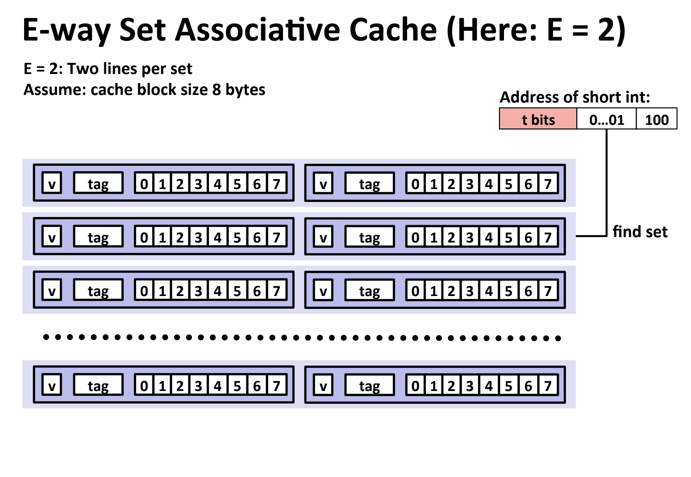
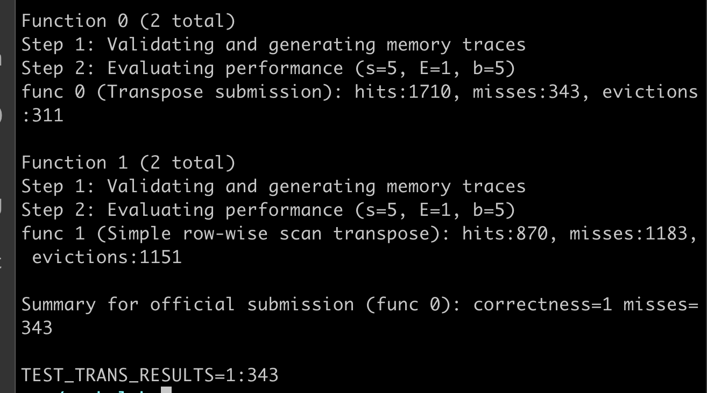
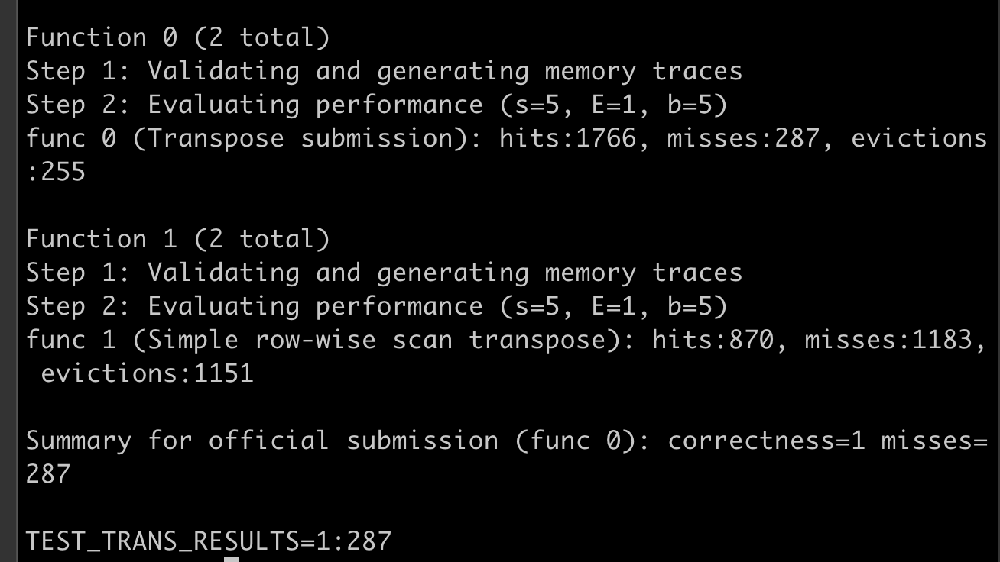
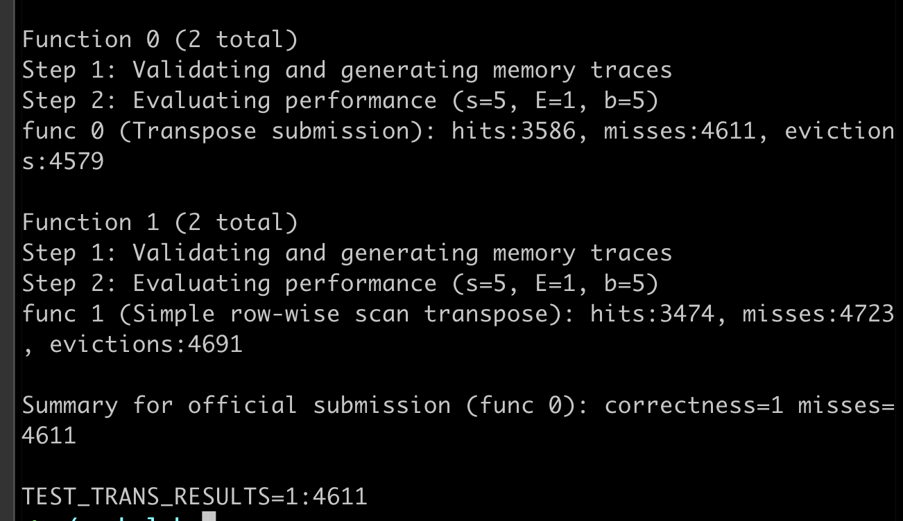
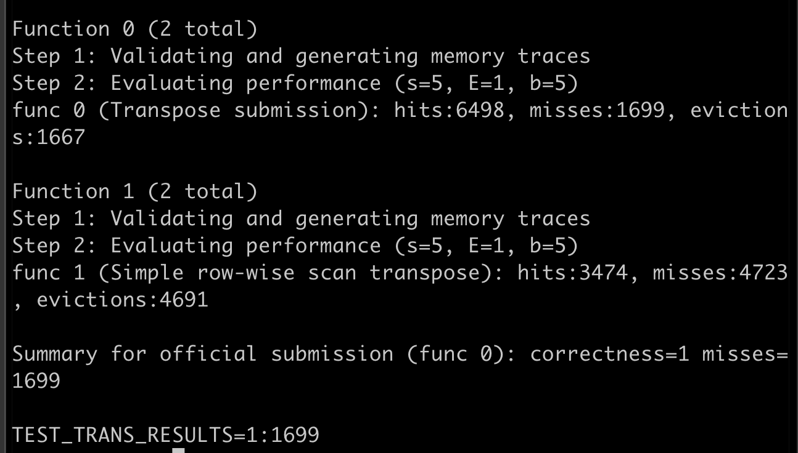

# CSAPP: Cache Lab 

## Data Structure for Cache 

The first thing we need to do is to design data strcuture to represent cache. 




So the first basic cache object is Line. 

```C
typedef struct Line {
    int valid; 
    int tag; 
    unsigned long time_stamp;  // used for LRU 
} Line; 
```

The next basic cache object is Set.

```C
typedef struct {
    int line_size; 
    int line_capacity; 
    Line* lines; 
} Set; 
```

```C
typedef struct {
    int size;
    Set* sets; 
} Cache; 
```

## Replacement Policy: LRU

The replacement policy is LRU. So for each line, we need to add a timestamp variable to record the used time. 

## Interface 

```C 
void write_cache(unsigned long address, unsigned int B, unsigned int S, unsigned int E);
char* read_cache(unsigned long address, unsigned int B, unsigned int S, unsigned int E); 
char* modify_cache(unsigned long address, unsigned int B, unsigned int S, unsigned int E); 
```


## Matrix Transpose and Locality 

### Naive Implementation 
The following implementation is ineffective because it does not make use of locality. 

```C
void trans(int M, int N, int A[N][M], int B[M][N])
{
    int i, j, tmp;

    for (i = 0; i < N; i++) {
        for (j = 0; j < M; j++) {
            tmp = A[i][j]; // use spatial locality 
            B[j][i] = tmp; // no spatial locality 
        }
    }    

}
```

### Locality 

#### Matrix 32 * 32

This version is to make use of  locality to improve performance. 

Assume the cache set size is 5, so there are 32 sets, and for each set, there is only one line. Each line is able to store 32 bytes, which means each line can store 8 integers. 

So the first solution is to use block.

Let block size = 8, so we need 16 sets. 


```C
void transpose_submit(int M, int N, int A[N][M], int B[M][N])
{
    int i, j, tmp, ii,  jj;

    int b = 8; 
    for (i = 0; i < N; i += b) {
        for (j = 0; j < M; j += b) {
            for(ii = i; ii < i + b; ii++) {
                for (jj = j; jj < j + b; jj ++) {
                    tmp = A[ii][jj]; 
                    B[jj][ii] = tmp;
                }
            }
        }
    }    
}
```

The following result is the performance, the performance is significantly improved from 1183 misses to 343 misses. But the misses should be smaller than 300 in order to get full score. 




From  the above code, total misses should be 8 * 16 * 2 = 256 , so why the misses became 343?  The reason may be two blocks are mapped into the same set. So the solution is to avoid such two blocks mapping into the same set. 

So in order to abovd block in A may be overriden by block in B, we need to preserve A block in advance. So we can use 8 variables to preserve the A block in advance. 

```C
void transpose_submit(int M, int N, int A[N][M], int B[M][N])
{
    int i, j, ii;

    int b = 8; 
    for (i = 0; i < N; i += b) {
        for (j = 0; j < M; j += b) {
            for(ii = i; ii < i + b; ii++) {
                int tmp0 = A[ii][j];
                int tmp1 = A[ii][ j + 1];
                int tmp2 = A[ii][ j + 2];
                int tmp3 = A[ii][ j + 3];
                int tmp4 = A[ii][ j + 4];
                int tmp5 = A[ii][ j + 5];
                int tmp6 = A[ii][ j + 6];
                int tmp7 = A[ii][ j + 7];

                B[j][ii] = tmp0;
                B[j + 1][ii] = tmp1;
                B[j + 2][ii] = tmp2;
                B[j + 3][ii] = tmp3;
                B[j + 4][ii] = tmp4;
                B[j + 5][ii] = tmp5;
                B[j + 6][ii] = tmp6;
                B[j + 7][ii] = tmp7;
            }
        }
    }    
}
```

The misses is reduced from 343 to 287.    




#### Matrix 64 * 64 

We still use block size = 8 to test how is the performance for matrix 64 * 64.

The total misses is only reduced little from 4723 to 4611.



So let's try block size = 4

```C
void transpose_submit(int M, int N, int A[N][M], int B[M][N])
{
    int i, j, ii;

    int b = 4; 
    for (i = 0; i < N; i += b) {
        for (j = 0; j < M; j += b) {
            for(ii = i; ii < i + b; ii++) {
                int tmp0 = A[ii][j];
                int tmp1 = A[ii][ j + 1];
                int tmp2 = A[ii][ j + 2];
                int tmp3 = A[ii][ j + 3];
                          

                B[j][ii] = tmp0;
                B[j + 1][ii] = tmp1;
                B[j + 2][ii] = tmp2;
                B[j + 3][ii] = tmp3;
              
            }
        }
    }    
}
```

The total misses is significantly reduced to 1699. 



