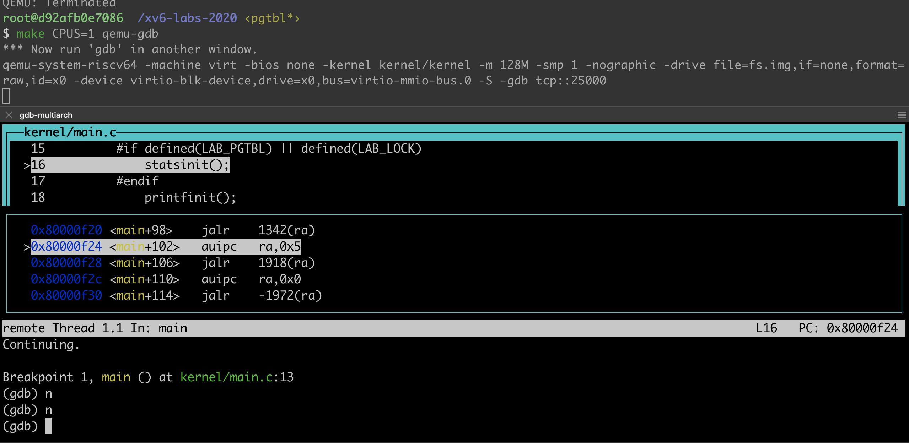

# Use gdb to debug xv6 in Ubuntu

Use following command to start xv6 for gdb debugging 

``` 
make CPUS=1 qemu-gdb
```

Configure .gdbinit
```
echo "add-auto-load-safe-path YOUR_PATH/xv6-labs-2020/.gdbinit " >> ~/.gdbinit
```

Run gdb 

```
gdb-multiarch
```




If you want to debug on a xv6 user program, use command `file` gdb like `file user/wc`, set breakpoint and then run `user program ` in xv6.

### Reference 

[Questions about debugging in xv6(riscv) -from MIT 6.S081/6.828 2019 OS course](https://stackoverflow.com/questions/62241780/questions-about-debugging-in-xv6riscv-from-mit-6-s081-6-828-2019-os-course)

