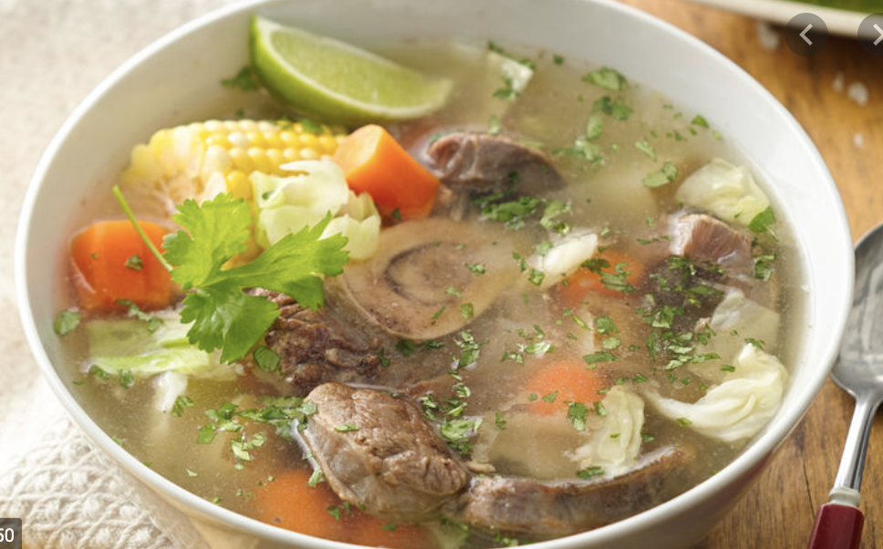

# Cardo de res, 墨西哥牛肉汤

家门口楼下有一家墨西哥超市，chavez, 超市里面有一家墨西哥快餐， 卖一些taco, burrito. 我们的最爱的是 beef burrito 和 beef soup. 因为特别喜欢吃这一家的牛肉汤， 所以我们打算尝试自己做。 

盗用了一张网上的照片。 我拍了一张自己炖的， 太丑了， 不忍心放上来。 是不是有点像大乱炖。 

我们总共做过两次， 第一次非常不成功，汤没有牛肉香味， 肉也非常的柴， 肉也没有炖烂。 

第二次就非常成功了， 汤里面有牛肉的香味， 带筋的牛肉炖得挺烂， 但是瘦牛肉就很柴了。 

所以， 下面是成功的秘诀：

1. 一定要有牛骨头， 保证牛肉的香味。 第二次炖汤，我们专门挑了牛骨头。 
2. 一定要选带筋的牛肉， 可以炖烂， 口感滑嫩。 
3. 一定不要选太瘦的牛肉。 不论炖多久， 吃起来都很柴。
4. 一定要放香菜。 
5. 如果用instant pot, 想要吃更烂的肉， 建议高压45分钟。

这次， 哈哈， 我们还做了A/B test， 我们选了两套炖汤教程

第一套是 慢炖， 属于慢工出细活， 因为牛骨头这玩意， 就是得炖的时间长一点，才能出香味，整个过程大概炖了 5 个小时。 具体教程在这里 [Caldo de Res Pa'Levantar Muertos](https://www.youtube.com/watch?v=LDketd0gQx4)

第二套是 高压炖，适合上班族， 我们用instant pot, 总共花了1个小时。 具体教程在这 [Caldo de Res- Mexican Beef Soup made in the Instant Pot](https://www.youtube.com/watch?v=Nvt1yBJNbSs)

A/B test 的结果是：

   1. 汤的香味， 两个教程都炖出香味。 香味的浓度， 我们觉得没有差别。 
   2. instant pot 炖的更烂。 牛肉炖了30分钟， 但是我们觉得需要炖45分钟更好。
   3. 结论是： 我们以后直接用 instant pot炖这道汤了。 

有一个问题值得思考，为什么1一个小时高压炖 和 5个小时慢炖 出来的香味差不多呢？ 原因是可能我们打开方式不对。 

- 牛骨头可能还得炖更长时间， 10个小时？ 
- 我看教程1的炖锅很高， 是不是跟炖的器具有关系？ 

2021年 6月 13号，早， 于加州湾区
