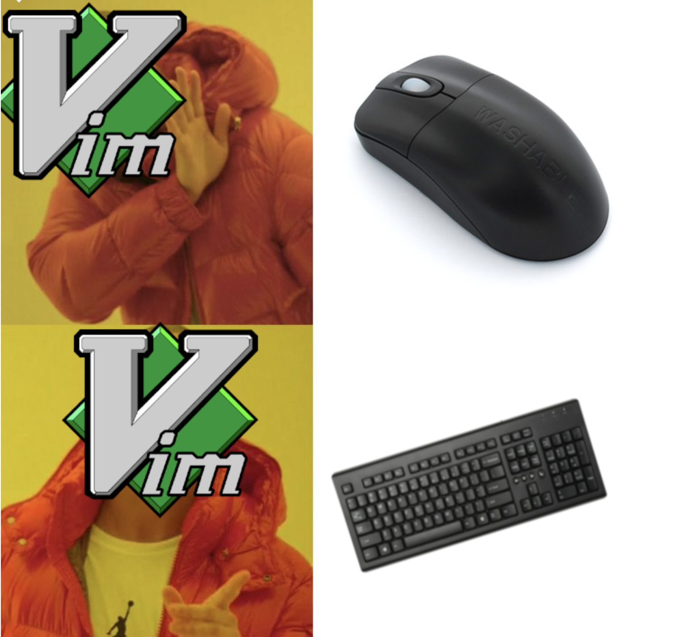

# Most frequent vim commands to improve productivity 

## Jumping 

|command| |
|---|---|
|b| jump backward by one word| 
|w| jump forward by one word|
|/pattern & n|search forward and then repeat forward search|
|:12| jump to a specific line|
|shift ^| jump to line start|
|shift $| jump to line end|
|j| jump down by one line|
|k| jump up by one line|

## Line oriented CRUD

|command||
|---|---|
|dd| delete current line |
|yy| copy current line |
| p| paste into next line|

## Word oriented CRUD

|command||
|---|---|
|cw| delete the word and then input new word|
|dw| just delete the word|
|yw| copy the word|

## Selection 

|command| |
|---|---|
|v & b| v: select from current word, b: repeat backward selection |
|v & w|w: repeat forward selection|
|v & shift+$| select from current cursor to line end|
|v & shift + s^| select from current cursor to line start|
|V| select current line|
|V & j|select current line and repeat line selection forward|
|V & k| select current line and repeat line selection backwar|

## Recovery 

|command||
|---|---|
|u| recovery from last command| 

