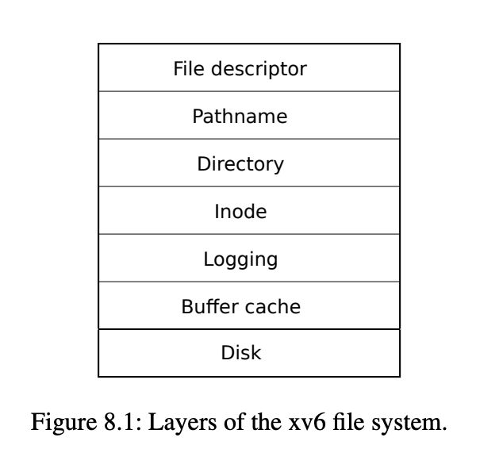

# xv6: Block Cache in File System 

Disk is slow, while mem is far more fast, so block cache is used to reduce the speed gab between mem and disk. 

Buffer cache is built on the top of Disk. The storage unit in disk is block, the Buffer Cache is to deal with block. 




bcache data structure. The buffers are linked by double linked list, which is a data structure frequently used in LRU. And the buffer cache also uses LRU. 


```C
struct {
  struct spinlock lock;
  struct buf buf[NBUF];

  // Linked list of all buffers, through prev/next.
  // Sorted by how recently the buffer was used.
  // head.next is most recent, head.prev is least.
  struct buf head;
} bcache;

```

A `buf` structure is mapping to a disk block. `valid = 0` indidates the block content in buffer is invalid, in other words, the buffer needs load content from disk.  

```C
struct buf {
  int valid;   // has data been read from disk?
  int disk;    // does disk "own" buf?
  uint dev;
  uint blockno;
  struct sleeplock lock;
  uint refcnt;
  struct buf *prev; // LRU cache list
  struct buf *next;
  uchar data[BSIZE];
};
```


Link all buffers into head. 
```C
void
binit(void)
{
  struct buf *b;

  initlock(&bcache.lock, "bcache");

  // Create linked list of buffers
  bcache.head.prev = &bcache.head;
  bcache.head.next = &bcache.head;
  for(b = bcache.buf; b < bcache.buf+NBUF; b++){
    b->next = bcache.head.next;
    b->prev = &bcache.head;
    initsleeplock(&b->lock, "buffer");
    bcache.head.next->prev = b;
    bcache.head.next = b;
  }
}
```

The first step is to try to find the block from buffer. If not found, then allocting a buffer using LRU strategy. It is important to ask why always return a blocked buffer? 
```C
// Look through buffer cache for block on device dev.
// If not found, allocate a buffer.
// In either case, return locked buffer.
static struct buf*
bget(uint dev, uint blockno)
{
  struct buf *b;

  acquire(&bcache.lock);

  // Is the block already cached?
  for(b = bcache.head.next; b != &bcache.head; b = b->next){
    if(b->dev == dev && b->blockno == blockno){
      b->refcnt++;
      release(&bcache.lock);
      acquiresleep(&b->lock);
      return b;
    }
  }

  // Not cached.
  // Recycle the least recently used (LRU) unused buffer.
  for(b = bcache.head.prev; b != &bcache.head; b = b->prev){
    if(b->refcnt == 0) {
      b->dev = dev;
      b->blockno = blockno;
      b->valid = 0;
      b->refcnt = 1;
      release(&bcache.lock);
      acquiresleep(&b->lock);
      return b;
    }
  }
  panic("bget: no buffers");
}
```

`bread` firstly get a buffer by calling `bget`. 

if buffer is invalid (`valid == 0`), it is to load data from disk to buffer by calling `virtio_disk_rw`
```C
// Return a locked buf with the contents of the indicated block.
struct buf*
bread(uint dev, uint blockno)
{
  struct buf *b;

  b = bget(dev, blockno);
  if(!b->valid) {
    virtio_disk_rw(b, 0);
    b->valid = 1;
  }
  return b;
}
```

writing is simple just by calling `virtio_disk_rw`. And why need to lock the buffer before writing,   
```
// Write b's contents to disk.  Must be locked.
void
bwrite(struct buf *b)
{
  if(!holdingsleep(&b->lock))
    panic("bwrite");
  virtio_disk_rw(b, 1);
}

```

Because when getting a buffer, it return a locked buffer, so it is very important to release a buffer when done of reading or writing . 

`brelse` provides such an API. Why moving to the head of most-recently-used list only when `refcnt` becomes 0 
```C
// Release a locked buffer.
// Move to the head of the most-recently-used list.
void
brelse(struct buf *b)
{
  if(!holdingsleep(&b->lock))
    panic("brelse");

  releasesleep(&b->lock);

  acquire(&bcache.lock);
  b->refcnt--;
  if (b->refcnt == 0) {
    // no one is waiting for it.
    b->next->prev = b->prev;
    b->prev->next = b->next;
    b->next = bcache.head.next;
    b->prev = &bcache.head;
    bcache.head.next->prev = b;
    bcache.head.next = b;
  }
  
  release(&bcache.lock);
}
```

why such two APIs? 
```C
void
bpin(struct buf *b) {
  acquire(&bcache.lock);
  b->refcnt++;
  release(&bcache.lock);
}

void
bunpin(struct buf *b) {
  acquire(&bcache.lock);
  b->refcnt--;
  release(&bcache.lock);
}
```